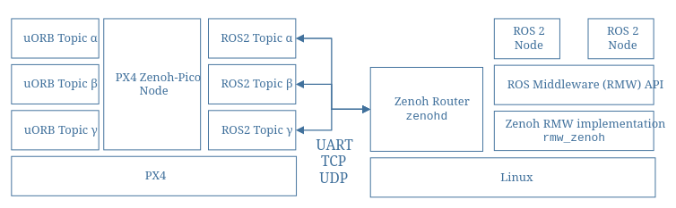

# Zenoh RMW with PX4

This repo tests zenoh middleware feature introduced in PX4 v1.17, you can have a look at list of features here -> [https://docs.px4.io/main/en/releases/1.17#ros-2-zenoh]

Description: PX4 supports Zenoh as an alternative mechanism (to DDS) for bridging uORB topics to ROS 2 (via the ROS 2 rmw_zenoh middleware). This allows uORB messages to be published and subscribed on a companion computer as though they were ROS 2 topics. It provides a fast and lightweight way to connect PX4 to ROS 2, making it easier for applications to access vehicle telemetry and send control commands.

The following guide describes the architecture and various options for setting up the Zenoh client and router. In particular, it covers the options that are most important to PX4 users exploring Zenoh as an alternative communication layer for ROS 2.

### GZ Setup
> Clone PX4-Autopilot and build px4_sitl_zenoh

Terminal 1
git clone https:px4-autopilot...
make px4_sitl_zenoh gz_x500

Terminal 2
ros2 run rmw_zenoh_cpp rmw_zenohd

Terminal 3
> Open Qground app and enable "ZENOH_ENABLE" parameter.

put image Errors/zenoh_enable.png

Terminal 4
> You can use following python scripts to test offboard control and monitor 
